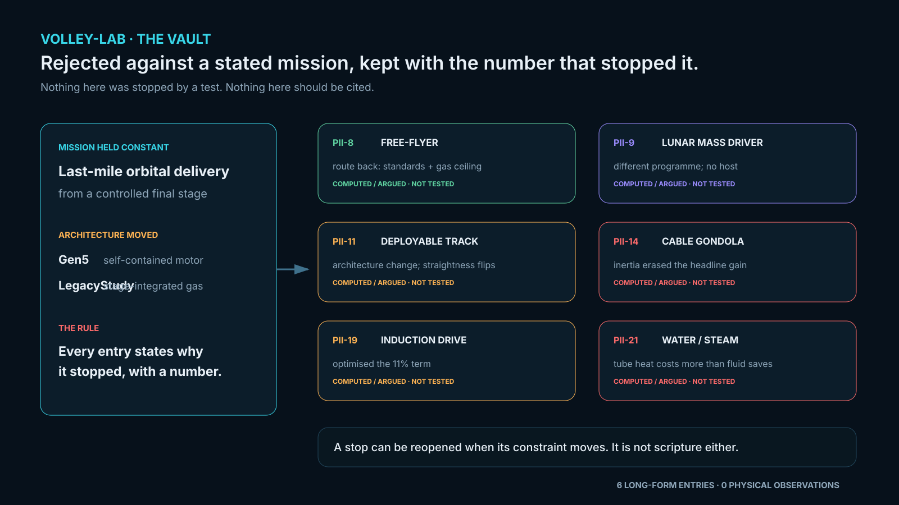
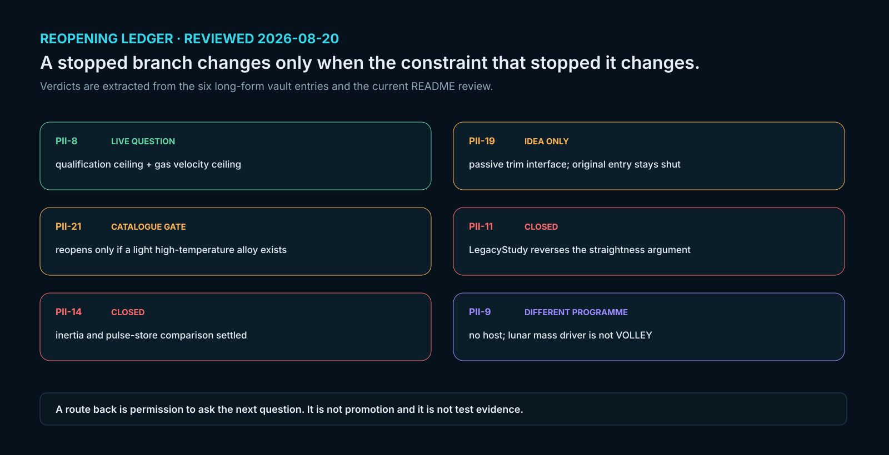
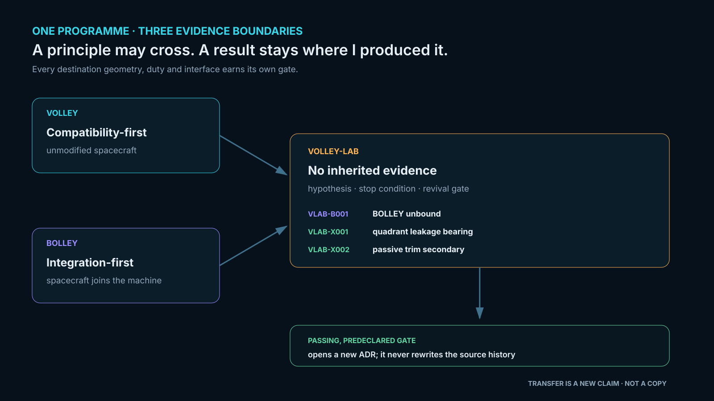

# VOLLEY-lab

### The architecture research vault

VOLLEY-lab preserves the alternatives that were tested, screened out or held behind a new evidence gate. A useful research programme needs to show **what stopped**, **which assumption controlled the answer**, and **what would have to change to reopen it**.

*Locally generated disposition map. Colour denotes research disposition, not test maturity. [Generate the map](tools/generate_readme_figure.py) · [Inspect the transfer ledger](TRANSFER_LEDGER.md).*

> **Programme position, October 2026:** VOLLEY **Gen5** is the controlled computational evaluation snapshot presented in the thesis and paper. It fails its evaluated 3U mass and reference-layout screens; its final freeze remains open. The alternative gas guide and independent spring-cell bank are historical, unselected studies. **Gen6** is the proposed first instrumented prototype programme, with its command range to be chosen from a payload and mission; a 1 km/s-class release is separate long-range research. No Gen6 architecture or speed has been validated. Nothing here has been built, fired, measured, qualified or flown.

[Audited market and spacecraft-fit research](MARKET_AND_CUSTOMER_FIT.md) frames the missions these branches would have to serve. The suggested 5–50 m/s region is a customer-discovery hypothesis; the 1 km/s upper goal is a different research regime.

The new ideal stroke screen makes that separation quantitative: accelerating a 4 kg payload to 1 km/s over Gen5's 1.3 m powered stroke requires at least $v^2/(2L g_0) \approx 39{,}220$ g under constant acceleration and gives $mv^2/2 = 2$ MJ of payload kinetic energy. A 10 g ideal stroke would be about 5.10 km. This is kinematics, not a motor or payload qualification. The [reproducible P124 screen](https://github.com/aaaaaaaaaaaavm/VOLLEY/blob/main/validation/P124_precision_delivery_design_space.md) and [prototype-to-flight gates](https://github.com/aaaaaaaaaaaavm/VOLLEY/blob/main/docs/GEN6_PROTOTYPE_TO_FLIGHT_ROADMAP.md) specify how a mission-derived first article is to be reviewed. Lab alternatives stay unselected until their own gates close.

The current Gen5 evaluation also found a **failed side-fed packaging fit**: a 205 mm track and two 166 mm cassettes require 537 mm inside a 526 mm enclosure. The native FreeCAD review assembly and exact-solid check are in the Gen5 engineering record. A feeder or enclosure change belongs to a new controlled configuration, with the mass and mission analyses rerun; no lab branch is promoted by that finding alone.

An [unselected R1 geometry screen](VLAB-X004_feeder_candidate_r1.md) now widens the enclosure to 570 mm and clears twelve scripted 3U transfer routes. It leaves actuation, restraint, tolerances, installed mass and host fit open. A separate finite-stator force screen also challenges Gen5's historical 16.029 m/s model point. The new [segmented-stator hypothesis](VLAB-X005_segmented_stator_hypothesis.md) records why reducing energized copper may matter, along with the physical winding and switch gates needed before promotion.

The [PII-19 passive-shuttle record](PII-19_induction_drive_legacy_study.md) now includes the Gen5 one-event **74.659 kg absolute device parity bound**. A passive plate shuttle was already studied here; its earlier mass and pulse-power objections still stand. The [H1 whole-system reassessment](https://github.com/aaaaaaaaaaaavm/VOLLEY/blob/main/docs/GEN5_H1_INTEGRATED_DEPLOYER_HYPOTHESIS.md) is an unselected question about structure, feed, drive and mission together, not a newly invented launcher or a promoted Gen5 revision.

*Geometry illustration imported from the R1 FreeCAD/STEP study: widened enclosure hidden to expose the cassette and track arrangement. This branch has no lift actuator, retention design, tolerance closure or revised installed mass. The image is not a fabricated article or a promoted Gen5 revision. [Image provenance](figures/r1_candidate_step.provenance.json) · [R1 disposition](VLAB-X004_feeder_candidate_r1.md).*

## How to read an entry

Each entry has its own assumptions, outcome and reopening condition. Its result belongs to that specific geometry and case. A number from a related study does not validate a VOLLEY payload interface, a Gen6 mechanism, or a flight product. The [transfer ledger](TRANSFER_LEDGER.md) states what may be reused and what must be recalculated at the destination.

| Study | What it asks | Present disposition |
|:--|:--|:--|
| [PII-8 free-flyer](PII-8_free_flyer.md) | Could the launcher become its own spacecraft for higher-energy delivery? | Rejected for the present hosted mission; long-track straightness, energy and payload load remain hard gates. |
| [PII-11 deployable track](PII-11_deployable_track.md) | Could deployment length improve efficiency and packaging? | Historical calculation; mechanism and deployed geometry unverified. |
| [PII-14 cable gondola](PII-14_cable_driven_gondola.md) | Could a cable and flywheel replace the electromagnetic drive? | Declined on the entry's calculated margins. |
| [PII-19 induction drive](PII-19_induction_drive_legacy_study.md) | Could a light passive mover replace the permanent-magnet sled? | Historical study; it optimised a mover representing only 11% of dry mass. |
| [PII-21 water fluids](PII-21_water_working_fluids.md) | Could water reduce gas-store mass in the historical pneumatic guide? | Historical fluid trade, with a steel-tube penalty that defeats the evaluated saving. |
| [VLAB-X003 independent cells](VLAB-X003_independent_cell_bank.md) | Could redundant motor-charged spring cells isolate jams? | Withdrawn from the shared sequential-path objective; twelve-payload mission screens did not close. |
| [VLAB-X004 feeder candidate R1](VLAB-X004_feeder_candidate_r1.md) | Can a wider enclosure provide a collision-free geometric 3U transfer path? | Twelve envelope routes clear in a scripted static/motion screen; real feeder and changed budgets open. |
| [VLAB-X005 segmented stator](VLAB-X005_segmented_stator_hypothesis.md) | Would local coil energization reduce copper loss under a finite-force shot? | Conditional model lowers copper heat; physical winding, switching and installed-system checks are open. |

Those are study findings, not proof that no different design could work. The full [branch register](BOLLEY_BRANCH_REGISTER.md) and [notes](notes/README.md) retain further ideas and history.

## Three maps of the research

 

*A reopening condition earns another study; it does not promote an architecture. A result moving between projects must be recalculated for its new geometry, interface and duty.*

The active cross-programme questions have their own local records:

| Branch | Current question and status |
|:--|:--|
| [VLAB-X001 quadrant leakage bearing](VLAB-X001_quadrant_gas_bearing.md) | Predeclared gas-bearing study; its controlled [run sheet](experiments/VLAB-X001/RUN_SHEET.md) and [inputs](experiments/VLAB-X001/parameters.json) are frozen. Read the entry for execution status and results. |
| [VLAB-X002 passive trim secondary](VLAB-X002_passive_trim_secondary.md) | Screens a deployer-owned passive secondary; no BOLLEY force or mass result transfers automatically. |
| [VLAB-B001 unbound interface](VLAB-B001_bolley_unbound.md) | Reopens spacecraft/deployer co-design variables for BOLLEY. |
| [VLAB-B002 active cooperation](VLAB-B002_active_cooperative_interface.md) | Asks whether spacecraft participation changes the pulse-power problem. |
| [VLAB-B003 distributed feed](VLAB-B003_distributed_fluxpiston_feed.md) | Compares feed topologies for a pressure interface; concepts await their stated gates. |

## Promotion rule

An idea can leave this vault only after it has predeclared acceptance bands, a reproducible result, a matched installed-system and mission comparison, explicit failure modes, and a new dated decision in its destination programme. The original failed record remains here. [Full rule and routing](TRANSFER_LEDGER.md).

**Inspect locally:** [source files](experiments/) · [generated visualisation script](tools/generate_readme_figure.py) · [repository gate](tools/check_repo.py) · [history](CHANGELOG.md).

**Related independent records:** [VOLLEY Gen5 engineering](https://github.com/aaaaaaaaaaaavm/VOLLEY) · [VOLLEY thesis](https://github.com/aaaaaaaaaaaavm/VOLLEY-thesis) · [VOLLEY paper](https://github.com/aaaaaaaaaaaavm/VOLLEY-paper) · [BOLLEY](https://github.com/aaaaaaaaaaaavm/BOLLEY). Each lab entry states its own basis; these links provide broader context.
